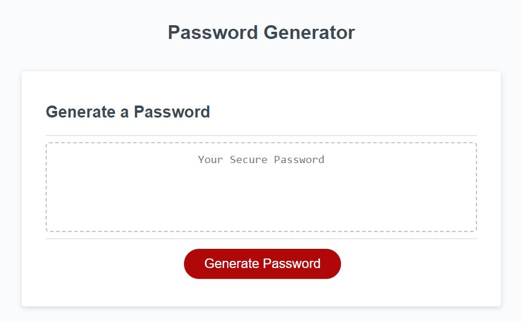

# Password Generation Webpage

## Description

My motivation to build this project was to improve my JavaScript skills.  I built this project so that I could practice writing JavaScript functions and boolean logic.  This 
project solves the problem of a user needing to be able to generate secure passwords for the various websites he or she uses.  For the password generation webpage, I included 
JavaScript logic to ask the user how long they want the password to be and what types of characters they want in the password.  I wrote the program to validate each input from the user 
and then use Math.Random() to generate a password from the types of characters that the user wanted.  In this challenge, I learned about how to generate JavaScript prompts and alert messages,
how to use event listeners, and how to generate a random string using Math.Random().

## Table of Contents (Optional)

This README isn't long, so N/A.

## Installation

N/A

## Usage

Here is a link to the deployed password generator webpage: https://theboss1485.github.io/password-generator-webpage/

To use the password generator, click the 'Generate Password' button.  The system will ask for a password length.  Enter a number between 8 and 128, inclusive, in digits, and 
click OK.  The system will then ask four questions regarding what characters the user wants in the password.  For each question, answer with 'yes' or 'no', and click OK.  
The system will then generate the password and display it inside of the dashed-border rectangle.

Here is a screenshot of the webpage: 

## Credits

I didn't have any human collaborators on this project.  However, I did use the OSU's Xpert Learning Assistant AI chatbot to give me the code for the generateCharacterString() function 
in assets/javascript/script.js.

## License

This project is under an MIT license.  Please see the license in the repository for more information.

## Badges

I don't have any badges to display.

## Features

This project has a password generator that generates a psuedo-random password after asking the user a series of questions about the new password.

## How to Contribute

This was a personal project of mine, so N/A.

## Tests

N/A